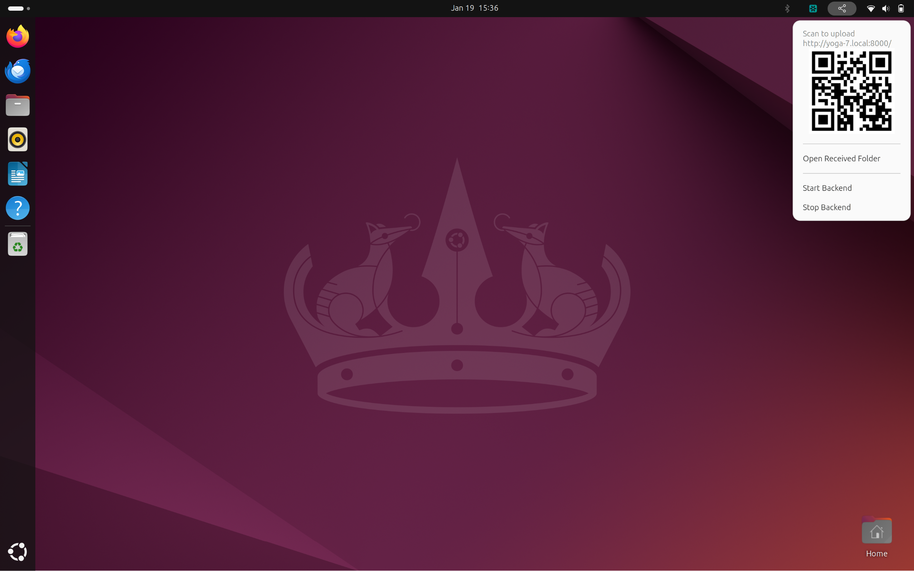
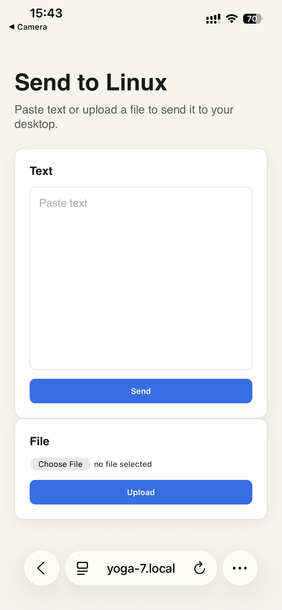
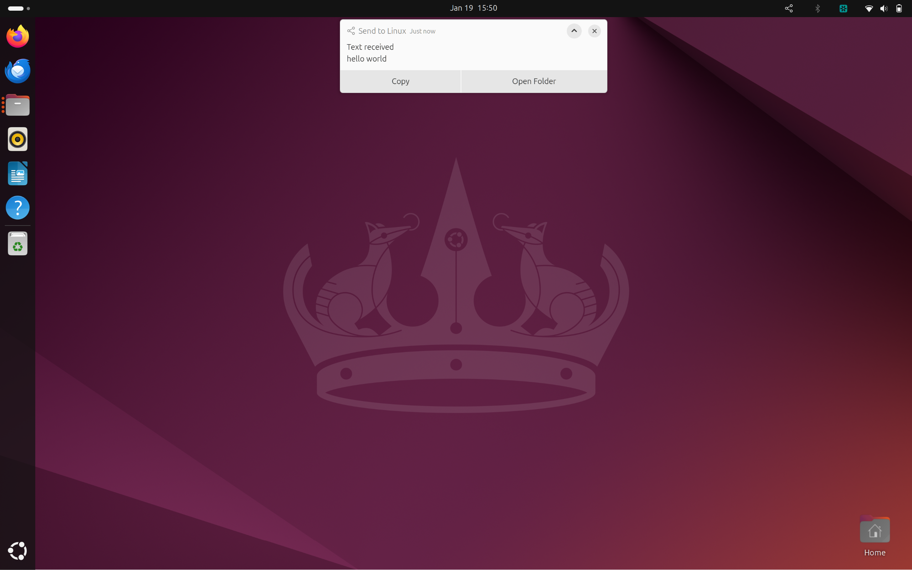

# Send to Linux (GNOME Extension + Go backend)

Receive text/files from iOS (or any device on same Wi-Fi) via a local web server, and surface them in GNOME:
- GNOME top bar extension (tray icon + popover)
- Local web server for upload (text + files)
- On receive: GNOME notification
- Text: one-click copy to clipboard (fallback: open as text file)
- Icon click: show QR code for upload URL

## Goals
- Minimal install friction: GNOME extension + single Go binary
- Real-time updates: backend emits D-Bus signals to extension (no polling)
- Keep GNOME Shell stable: heavy work in backend process

## Components
- `backend/` Go daemon
  - HTTP server for uploads
  - Saves files to `~/Downloads/SendToLinux/` (default)
  - Emits D-Bus signals when items arrive
  - Provides status methods (URL/port, recent items, QR PNG path)
  - Generates QR PNG for the upload URL
- `extension/` GNOME Shell extension (GJS)
  - Top bar icon + popover
  - Shows backend status, URL, and QR code in the popover
  - Subscribes to D-Bus signals for real-time updates
  - Shows notifications, supports copy-to-clipboard

## Quick start (dev)
1. Build backend
2. Run backend locally
3. Install extension from `extension/` into `~/.local/share/gnome-shell/extensions/`
4. Restart GNOME Shell / enable extension
5. Open QR from top bar and upload from iOS

See:
- `docs/ARCHITECTURE.md`
- `docs/DBUS.md`
- `docs/DEV.md`
- `docs/TODO.md`

## Screenshots

## Non-goals (for MVP)
- Auth tokens / user accounts
- Internet exposure (LAN only)
- Background sync or cloud storage
